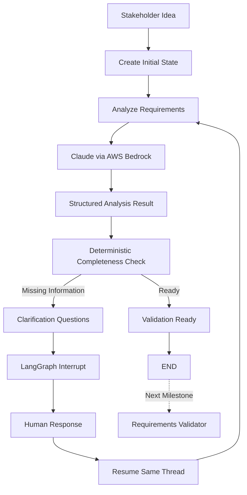
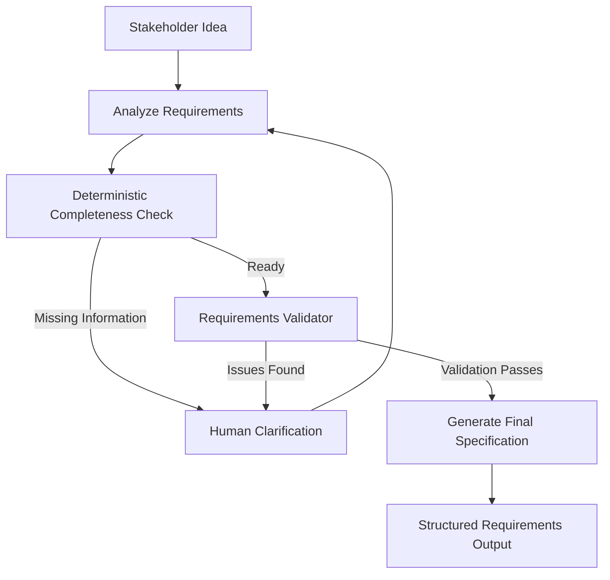

# AI Requirements Collection Agent

A lightweight LangGraph-based prototype for iterative software requirements collection, clarification, and readiness assessment.

The project explores how an LLM can assist a software requirements engineer by analyzing incomplete stakeholder ideas, identifying missing requirement areas, asking targeted clarification questions, preserving conversation context, and iteratively refining the requirements before handing them to a separate validation stage.

## Current Status

The prototype currently supports:

* Python project structure with testing and linting
* Pydantic schemas for structured requirements data
* Shared LangGraph state
* AWS Bedrock / Claude integration
* Structured LLM output
* Requirements analysis
* Requirement-area coverage assessment
* Assumption tracking
* Targeted clarification-question generation
* Human-in-the-loop clarification
* Conversation-history preservation
* Iterative re-analysis after stakeholder responses
* Deterministic completeness/readiness checks
* Maximum clarification-round protection
* LangGraph conditional routing
* LangGraph interrupt/resume workflow
* In-memory checkpointing
* Interactive CLI demonstration
* Unit tests with `pytest`
* Static analysis with `ruff`

The project currently stops when requirements are considered ready to enter the validation stage.

The dedicated validator and final requirements specification generator are the next milestones.

---

## Example Use Case

Initial stakeholder idea:

```text
Build an application where university students can reserve study rooms.
```

The agent initially identifies confirmed information such as:

* university students are users
* students need to reserve study rooms

It also identifies missing areas such as:

* authentication
* administrator roles
* reservation policies
* room attributes
* security
* integrations
* non-functional requirements

The agent then generates targeted clarification questions.

Example:

```text
1. Besides students, are there other roles that interact with the system?

2. How should students authenticate?

3. What booking rules apply?

4. What attributes describe a study room?

5. Are there existing university systems that must be integrated?
```

The stakeholder provides answers.

The graph stores those answers in conversation history, resumes the same workflow, and analyzes the updated requirements again.

This continues until the deterministic readiness criteria are satisfied or the configured maximum number of clarification rounds is reached.

---

## Current Workflow

```text
Stakeholder Idea
      ↓
Create Initial State
      ↓
Analyze Requirements
      ↓
Claude / AWS Bedrock
      ↓
Structured AnalysisResult
      ↓
Deterministic Completeness Check
      ↓
 ┌───────────────────────────────┐
 │                               │
Missing Information        Ready for Validation
 │                               │
 ▼                               ▼
Clarification Questions    Validation Boundary
 │                               │
 ▼                               ▼
LangGraph interrupt()            END
 │
 ▼
Human Response
 │
 ▼
Command(resume=...)
 │
 ▼
Conversation State Restored
 │
 ▼
Analyze Again
```

---

## Architecture



---

## Design Principles

The prototype intentionally separates LLM reasoning from workflow control.

### 1. The LLM does not control completion

Claude performs tasks such as:

* requirement extraction
* stakeholder identification
* coverage analysis
* assumption identification
* clarification-question generation

However, Claude does not decide when the collection process is complete.

A deterministic Python rubric makes that decision.

---

### 2. Confirmed requirements and assumptions are separated

The analyzer is instructed not to treat plausible ideas as confirmed requirements.

For example:

```text
Stakeholder says:
"Students reserve rooms."

Confirmed:
Students can reserve study rooms.

Possible inference:
Administrators may manage rooms.

Correct behavior:
Ask whether administrators exist instead of treating them as confirmed.
```

---

### 3. Human-in-the-loop is part of the workflow

When missing information exists, the LangGraph workflow pauses using an interrupt.

The stakeholder answers the clarification questions.

The same graph session is resumed using:

```python
Command(resume=response)
```

Conversation history is preserved so the next analysis has the full context.

---

### 4. Infinite questioning is prevented

The workflow has a configurable maximum number of clarification rounds.

```env
MAX_CLARIFICATION_ROUNDS=3
```

If the limit is reached, the workflow proceeds to validation rather than asking questions indefinitely.

Reaching this limit does not imply the requirements are complete.

It means that the collection stage should stop and unresolved issues should be handled by the validation stage.

---

## Deterministic Readiness Check

The current completeness logic checks major requirement categories:

* actors
* functional requirements
* non-functional requirements
* data
* security
* constraints
* dependencies

The workflow can proceed toward validation when:

* no core category is completely missing
* only a small number of clarification questions remain

or when:

* the maximum clarification-round limit has been reached

This provides a deterministic guardrail around the LLM.

---

## LangGraph State

The shared graph state currently contains information similar to:

```text
project_idea
conversation_history
stakeholders
collected_requirements
assumptions
coverage
open_questions
validation_issues
clarification_round
max_clarification_rounds
ready_for_validation
validation_passed
final_specification
```

This state is shared across workflow nodes.

---

## Structured LLM Output

The LLM does not return arbitrary unvalidated JSON.

Pydantic models are used for structured output.

Examples include:

* `Stakeholder`
* `Requirement`
* `ClarificationQuestion`
* `CoverageAssessment`
* `AnalysisResult`
* `ValidationIssue`
* `ValidationResult`
* `FunctionalRequirement`
* `NonFunctionalRequirement`
* `UserStory`
* `FinalSpecification`

This improves consistency and makes the agent workflow easier to validate and test.

---

## Project Structure

```text
requirements-collection-agent/
│
├── examples/
│   └── run_collection.py
│
├── src/
│   └── requirements_agent/
│       ├── llm/
│       │   └── provider.py
│       │
│       ├── nodes/
│       │   └── analyze.py
│       │
│       ├── prompts/
│       │   └── analysis.py
│       │
│       ├── completeness.py
│       ├── config.py
│       ├── graph.py
│       ├── interaction.py
│       ├── schemas.py
│       └── state.py
│
├── tests/
│   ├── test_analyze_node.py
│   ├── test_completeness.py
│   ├── test_graph.py
│   ├── test_interaction.py
│   ├── test_schemas.py
│   ├── test_setup.py
│   └── test_state.py
│
├── .env.example
├── .gitignore
├── pyproject.toml
└── README.md
```

---

## Tech Stack

* Python 3.11+
* LangGraph
* LangChain AWS
* AWS Bedrock
* Claude
* Pydantic
* Pydantic Settings
* pytest
* Ruff

---

## Setup

Clone the repository:

```bash
git clone https://github.com/nithikeshreddy/requirements-collection-agent.git
cd requirements-collection-agent
```

Create a virtual environment:

```bash
python3.11 -m venv .venv
source .venv/bin/activate
```

Install dependencies:

```bash
pip install -e ".[dev]"
```

Create the local environment file:

```bash
cp .env.example .env
```

Example:

```env
LLM_PROVIDER=bedrock
AWS_REGION=us-east-1
BEDROCK_MODEL_ID=
MAX_CLARIFICATION_ROUNDS=3
LOG_LEVEL=INFO
```

Configure a Bedrock model available in your AWS account.

---

## AWS Authentication

AWS credentials are not stored in this repository.

The application uses the normal AWS credential chain.

Possible authentication methods include:

* AWS CLI credentials
* AWS CLI profiles
* AWS SSO
* environment-based credentials
* IAM roles in a deployed environment

Do not commit:

```text
.env
AWS access keys
AWS secret keys
AWS session tokens
credential files
```

The `.env` file is ignored by Git.

---

## Run Tests

```bash
python -m pytest -q
```

Current test status:

```text
17 passed
```

Run linting:

```bash
ruff check .
```

Expected:

```text
All checks passed!
```

---

## Run the Interactive Demo

Run:

```bash
python examples/run_collection.py
```

The application begins with the example:

```text
Build an application where university students can reserve study rooms.
```

The graph analyzes the idea and displays clarification questions:

```text
Clarification Round 1

1. Besides students, who else interacts with the system?
2. What additional reservation actions are required?
3. How should students authenticate?
4. What booking rules apply?
5. Are there technical or integration constraints?

Stakeholder:
```

Enter answers in one response.

The graph resumes the same conversation and analyzes the updated requirements.

If additional information is needed, another clarification round is generated.

Example:

```text
Clarification Round 2
...
```

Once the deterministic readiness criteria are satisfied:

```text
Requirements collection finished.
Ready for validation: True
```

`Ready for validation: True` does not mean that the requirements have passed validation.

It means that the requirements collection stage has enough information to attempt the separate validation stage.

---

## Why LangGraph?

The workflow contains:

* mutable shared state
* iterative analysis
* conditional routing
* loops
* human interaction
* pause/resume behavior
* checkpointing

This makes the problem naturally graph-oriented.

LangGraph allows the workflow to pause when human clarification is required and later resume the same session while preserving the conversation state.

---

## Development Progress

### Milestone 1 — Project Setup

* [x] Repository structure
* [x] Python virtual environment
* [x] `pyproject.toml`
* [x] pytest
* [x] Ruff
* [x] environment-variable configuration

### Milestone 2 — Schemas and State

* [x] Pydantic models
* [x] Requirement categories
* [x] Coverage model
* [x] Validation schemas
* [x] Final specification schemas
* [x] LangGraph shared state
* [x] Conversation history

### Milestone 3 — Requirements Analysis

* [x] AWS Bedrock integration
* [x] Claude requirements analyzer
* [x] Structured output
* [x] Stakeholder extraction
* [x] Requirement extraction
* [x] Coverage analysis
* [x] Assumption tracking
* [x] Clarification-question generation

### Milestone 4 — Human Clarification

* [x] Human clarification responses
* [x] Conversation-history updates
* [x] Clarification-round tracking
* [x] Iterative re-analysis

### Milestone 5 — LangGraph Workflow

* [x] Deterministic readiness rubric
* [x] Conditional routing
* [x] Clarification loop
* [x] `interrupt()`
* [x] `Command(resume=...)`
* [x] checkpointed conversation threads
* [x] maximum clarification rounds
* [x] interactive CLI demonstration

### Milestone 6 — Validation

Next:

* [ ] Requirements validator node
* [ ] Missing-requirement detection
* [ ] Ambiguity detection
* [ ] Contradiction detection
* [ ] Security review
* [ ] Testability review
* [ ] Validation-to-clarification routing

### Milestone 7 — Final Specification

Planned:

* [ ] project summary
* [ ] actors / roles
* [ ] functional requirements
* [ ] non-functional requirements
* [ ] epics
* [ ] user stories
* [ ] acceptance criteria
* [ ] constraints
* [ ] dependencies
* [ ] open assumptions

---

## Planned End-to-End Workflow



---

## Future Extensions

Possible later improvements include:

* Streamlit chat interface
* persistent LangGraph checkpointing
* Jira REST API integration
* GitHub Issues integration
* requirements-version tracking
* automated evaluation
* Docker
* cloud deployment
* FastAPI service
* multi-stakeholder workflows

These are intentionally outside the initial MVP.

---

## Evaluation and Research Direction

The prototype can later be evaluated scientifically across several dimensions.

### Requirement Completeness

Measure how many expected requirement categories are successfully discovered.

### Clarification Question Relevance

Evaluate whether generated questions address meaningful missing information.

### Duplicate Question Rate

Measure whether the system unnecessarily asks questions that were already answered.

### Number of Clarification Turns

Measure how efficiently the agent reaches validation readiness.

### Ambiguity Detection

Evaluate whether vague requirements such as:

```text
The application should be fast.
```

are correctly identified as non-testable or ambiguous.

### Contradiction Detection

Evaluate whether conflicting stakeholder statements are identified.

### Testability

Measure whether final requirements contain measurable acceptance conditions.

### Structured Output Reliability

Measure how often generated outputs successfully satisfy the required Pydantic schemas.

### Latency and Cost

Track:

* Bedrock latency
* number of LLM calls
* token usage
* cost per requirements session

---

## Current Limitations

This project is currently an MVP.

The system does not yet:

* perform the dedicated validation stage
* detect contradictions through a validator node
* perform formal ambiguity analysis
* generate the final requirements specification
* persist sessions between application restarts
* provide a graphical UI
* integrate with Jira
* integrate with GitHub Issues
* provide automated research-grade evaluation metrics

The current implementation focuses specifically on reliable iterative requirements collection and human-in-the-loop orchestration.

---

## Goal

The long-term goal is to explore how agentic workflows can support requirements elicitation during the Software Development Life Cycle while keeping humans involved in important decisions and avoiding reliance on an LLM as the sole source of truth.
