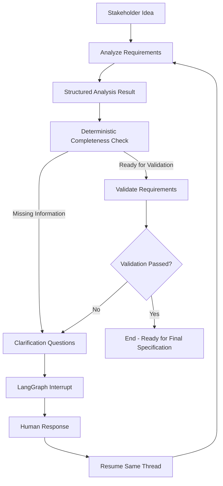
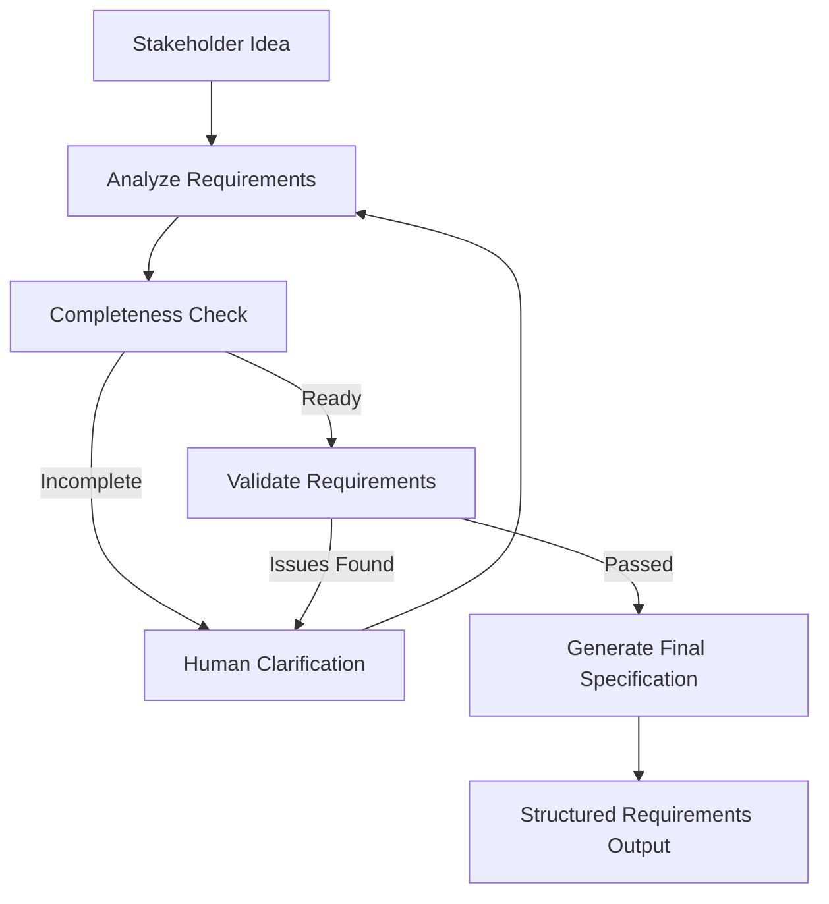

# AI Requirements Collection Agent

A LangGraph-based prototype for iterative software requirements elicitation, human clarification, validation, and readiness assessment during the Software Development Life Cycle (SDLC).

The system behaves like a software requirements engineer: it analyzes an incomplete project idea, identifies missing requirement areas, asks targeted questions, preserves stakeholder responses, validates the collected requirements, and routes unresolved validation issues back to the stakeholder.

## Current Capabilities

The prototype currently supports:

* Structured requirements models using Pydantic
* Shared LangGraph state
* AWS Bedrock / Claude integration
* Structured LLM outputs
* Requirements extraction
* Stakeholder identification
* Requirement coverage assessment
* Assumption tracking
* Targeted clarification questions
* Human-in-the-loop interaction
* Conversation history preservation
* Iterative requirements analysis
* Deterministic readiness checks
* Maximum clarification-round protection
* LangGraph conditional routing
* `interrupt()` / `Command(resume=...)`
* In-memory checkpointing
* Dedicated requirements validation
* Validation issue detection
* Validation-to-clarification routing
* Deterministic validation guardrails
* Offline unit tests using mocked LLMs
* Interactive CLI demo
* `pytest` and Ruff checks

The next milestone is generation of the final structured requirements specification.

---

## Example

Initial stakeholder idea:

```text
Build an application where university students can reserve study rooms.
```

The analyzer identifies known information and missing areas.

For example:

```text
Known:
- University students are users.
- Students need to reserve study rooms.

Missing:
- Authentication
- Administrator responsibilities
- Booking policies
- Room attributes
- Security requirements
- Integrations
- Non-functional requirements
```

The system then asks targeted clarification questions.

Stakeholder responses are saved in conversation history and the requirements are analyzed again.

Once the deterministic readiness criteria are satisfied, the collected requirements move to a separate validation stage.

---

## Current Workflow



---

## Architecture Principles

### Separate elicitation from validation

The requirements analyzer answers:

> What information do we currently know, and what should we ask next?

The validator answers:

> Are the collected requirements consistent, unambiguous, secure, and testable?

These are separate nodes with separate prompts and structured outputs.

This prevents the same step from both generating and approving its own requirements.

---

### The LLM does not control workflow completion

Claude performs semantic reasoning such as:

* extracting requirements
* identifying assumptions
* assessing requirement coverage
* identifying validation issues
* generating clarification questions

Python controls workflow decisions.

The deterministic completeness logic decides whether requirements are ready to enter validation.

The validation guardrail also requires:

```text
LLM says passed
AND
there are zero validation issues
```

before:

```text
validation_passed = True
```

---

### Human-in-the-loop

If information is missing or validation finds an issue, LangGraph pauses:

```python
interrupt(...)
```

The stakeholder provides an answer.

The workflow resumes using:

```python
Command(resume=response)
```

The same `thread_id` allows LangGraph to restore the checkpointed conversation and continue from where it paused.

---

### Maximum clarification rounds

The workflow prevents infinite questioning.

```env
MAX_CLARIFICATION_ROUNDS=3
```

If the maximum is reached, the workflow stops requesting additional clarification.

Importantly, reaching the limit does **not** automatically mean validation succeeded.

It is possible to finish with:

```text
Ready for validation: True
Validation passed: False
```

This means unresolved validation issues remain.

---

## Requirements Validation

The validator checks the collected requirements for:

* missing important requirements
* contradictions
* ambiguous language
* security and privacy concerns
* undefined actors or permissions
* incomplete functional behavior
* missing non-functional requirements
* unclear constraints
* unclear dependencies
* lack of testability

Example:

```text
Requirement:
"The application should be fast."
```

The validator may identify:

```text
Issue Type:
Testability

Problem:
"Fast" does not define a measurable performance target.

Clarification:
What response-time target should normal user actions meet?
```

The clarification question is routed back through the same human-in-the-loop workflow.

---

## LangGraph State

The shared graph state contains:

```text
project_idea
conversation_history

stakeholders
collected_requirements
assumptions

coverage
open_questions

validation_issues

clarification_round
max_clarification_rounds

ready_for_validation
validation_passed

final_specification
```

Nodes read this shared state and return only the fields they need to update.

---

## Structured Output

Pydantic models are used instead of arbitrary LLM-generated JSON.

Current models include:

* `Stakeholder`
* `Requirement`
* `ClarificationQuestion`
* `CoverageAssessment`
* `AnalysisResult`
* `ValidationIssue`
* `ValidationResult`
* `FunctionalRequirement`
* `NonFunctionalRequirement`
* `Epic`
* `UserStory`
* `FinalSpecification`

This provides predictable data contracts between LLM reasoning and the workflow.

---

## Project Structure

```text
requirements-collection-agent/
│
├── examples/
│   └── run_collection.py
│
├── src/
│   └── requirements_agent/
│       ├── llm/
│       │   └── provider.py
│       │
│       ├── nodes/
│       │   ├── analyze.py
│       │   └── validate.py
│       │
│       ├── prompts/
│       │   ├── analysis.py
│       │   └── validation.py
│       │
│       ├── completeness.py
│       ├── config.py
│       ├── graph.py
│       ├── interaction.py
│       ├── schemas.py
│       └── state.py
│
├── tests/
│   ├── test_analyze_node.py
│   ├── test_completeness.py
│   ├── test_graph.py
│   ├── test_interaction.py
│   ├── test_schemas.py
│   ├── test_setup.py
│   ├── test_state.py
│   └── test_validate_node.py
│
├── .env.example
├── .gitignore
├── pyproject.toml
└── README.md
```

---

## Tech Stack

* Python 3.11+
* LangGraph
* LangChain AWS
* AWS Bedrock
* Claude
* Pydantic
* Pydantic Settings
* pytest
* Ruff

---

## Setup

Clone the repository:

```bash
git clone https://github.com/nithikeshreddy/requirements-collection-agent.git
cd requirements-collection-agent
```

Create the environment:

```bash
python3.11 -m venv .venv
source .venv/bin/activate
```

Install dependencies:

```bash
pip install -e ".[dev]"
```

Create local configuration:

```bash
cp .env.example .env
```

Example:

```env
LLM_PROVIDER=bedrock
AWS_REGION=us-east-1
BEDROCK_MODEL_ID=
MAX_CLARIFICATION_ROUNDS=3
LOG_LEVEL=INFO
```

AWS credentials are not stored in this repository.

The application uses the normal AWS credential chain, such as AWS CLI credentials, AWS profiles, AWS SSO, or IAM roles.

---

## Run Tests

```bash
python -m pytest -q
```

Run linting:

```bash
ruff check .
```

Both should complete successfully before changes are committed.

The graph and validator tests use mocked LLM behavior, so unit tests do not require Bedrock API calls.

---

## Run the Interactive Demo

```bash
python examples/run_collection.py
```

The graph starts from:

```text
Build an application where university students can reserve study rooms.
```

It analyzes the idea and may pause with:

```text
Clarification Round 1

1. ...
2. ...
3. ...

Stakeholder:
```

After answering, LangGraph resumes the same checkpointed thread and analyzes the new information.

The cycle can continue through:

```text
Analyze
→ Clarify
→ Analyze
→ Completeness Check
→ Validate
→ Clarify if needed
→ Validate again
```

---

## Planned Final Workflow



---

## Evaluation / Research Direction

Potential evaluation dimensions include:

* requirement completeness
* clarification-question relevance
* duplicate-question rate
* number of clarification turns
* ambiguity detection
* contradiction detection
* security issue identification
* requirement testability
* validator precision and recall
* user-story quality
* acceptance-criteria quality
* Pydantic schema reliability
* latency
* LLM calls
* token usage
* cost per requirements session

---

## Current Limitations

The system does not yet:

* generate the final requirements specification
* persist sessions across application restarts
* provide a graphical interface
* integrate with Jira
* integrate with GitHub Issues
* support multiple simultaneous stakeholder identities
* provide automated research-grade evaluation metrics

The current MVP focuses on requirements elicitation, iterative clarification, workflow orchestration, and validation.

---

## Goal

The goal of this project is to explore how agentic workflows can support requirements engineering during the SDLC while keeping humans involved in important decisions and preventing the LLM from becoming the sole authority over requirements completeness or quality.
