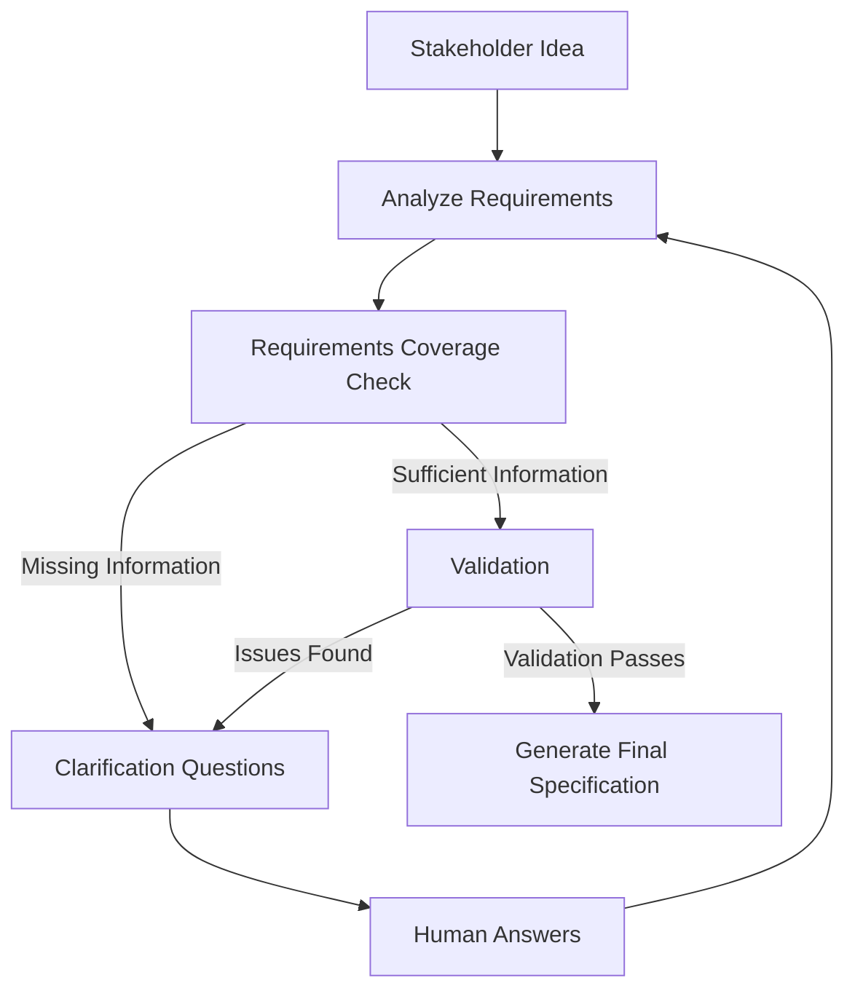

# AI Requirements Collection Agent

A lightweight prototype for using an LLM as a software requirements engineering assistant.

The project explores how an agent can analyze an incomplete software idea, identify missing requirement areas, extract confirmed requirements, record assumptions, and generate targeted clarification questions.

## Current Status

The prototype currently supports:

* Structured requirements schemas using Pydantic
* Shared agent state for a LangGraph workflow
* Conversation history and requirement coverage tracking
* AWS Bedrock / Claude integration
* Structured LLM output using Pydantic models
* Requirements analysis from an initial stakeholder idea
* Identification of:

  * stakeholders
  * functional requirements
  * assumptions
  * missing requirement areas
  * clarification questions
* Unit tests with `pytest`
* Static analysis with `ruff`

Current workflow:

```text
Stakeholder Idea
      ↓
Create Agent State
      ↓
Requirements Analysis Node
      ↓
Claude via AWS Bedrock
      ↓
Structured AnalysisResult
      ↓
Requirements + Coverage + Clarification Questions
```

Human-in-the-loop clarification, validation, graph routing, and final specification generation are planned next.

## Example

Input:

```text
Build an application where university students can reserve study rooms.
```

The analyzer can identify confirmed information such as:

* University students are stakeholders
* Students need to reserve study rooms

It can also identify missing areas such as:

* authentication
* reservation policies
* room attributes
* additional actors
* security requirements
* integrations
* non-functional requirements

The system then generates targeted clarification questions instead of treating unconfirmed information as established requirements.

## Architecture

The project is being designed around the following workflow:



The LLM is not intended to be the sole authority for determining requirement completeness. A deterministic requirements checklist and validation layer will be added as the workflow develops.

## Project Structure

```text
requirements-collection-agent/
├── src/
│   └── requirements_agent/
│       ├── llm/
│       │   └── provider.py
│       ├── nodes/
│       │   └── analyze.py
│       ├── prompts/
│       │   └── analysis.py
│       ├── config.py
│       ├── schemas.py
│       └── state.py
├── tests/
├── examples/
├── .env.example
├── .gitignore
└── pyproject.toml
```

## Tech Stack

* Python 3.11+
* LangGraph
* Pydantic
* LangChain AWS
* AWS Bedrock
* Claude
* pytest
* Ruff

## Setup

Clone the repository:

```bash
git clone https://github.com/nithikeshreddy/requirements-collection-agent.git
cd requirements-collection-agent
```

Create a virtual environment:

```bash
python3.11 -m venv .venv
source .venv/bin/activate
```

Install dependencies:

```bash
pip install -e ".[dev]"
```

Create a local environment file:

```bash
cp .env.example .env
```

Configure the required values in `.env`.

Example:

```env
LLM_PROVIDER=bedrock
AWS_REGION=us-east-1
BEDROCK_MODEL_ID=
MAX_CLARIFICATION_ROUNDS=3
LOG_LEVEL=INFO
```

AWS credentials are **not stored in this repository**. Authentication should use the normal AWS credential chain, such as an AWS CLI profile or AWS SSO.

## Run Tests

```bash
python -m pytest -q
```

Run linting:

```bash
ruff check .
```

## Development Roadmap

Completed:

* [x] Project structure and Python environment
* [x] Pydantic schemas
* [x] LangGraph shared state
* [x] Structured requirements-analysis node
* [x] AWS Bedrock / Claude integration

Next:

* [ ] Human-in-the-loop clarification
* [ ] Clarification loop
* [ ] Deterministic completeness rubric
* [ ] Requirements validation node
* [ ] Final structured requirements generation
* [ ] End-to-end LangGraph workflow
* [ ] Sample output and evaluation

Possible later extensions:

* Streamlit interface
* LangGraph checkpointing
* Jira / GitHub Issues integration
* Evaluation metrics
* Docker
* Cloud deployment

## Research / Evaluation Direction

Potential evaluation dimensions include:

* requirement completeness
* ambiguity detection
* contradiction detection
* clarification-question relevance
* duplicate-question rate
* number of clarification rounds
* requirement testability
* user-story quality
* acceptance-criteria quality
* schema validation reliability
* latency
* token usage and cost

## Limitations

This is currently an early prototype.

The system does not yet:

* autonomously determine final requirement completeness
* execute a full clarification loop
* validate contradictions or ambiguity in a separate validation stage
* generate the final requirements specification
* persist sessions
* integrate with Jira or GitHub Issues

The current focus is establishing a reliable, structured requirements-analysis foundation before adding workflow complexity.
